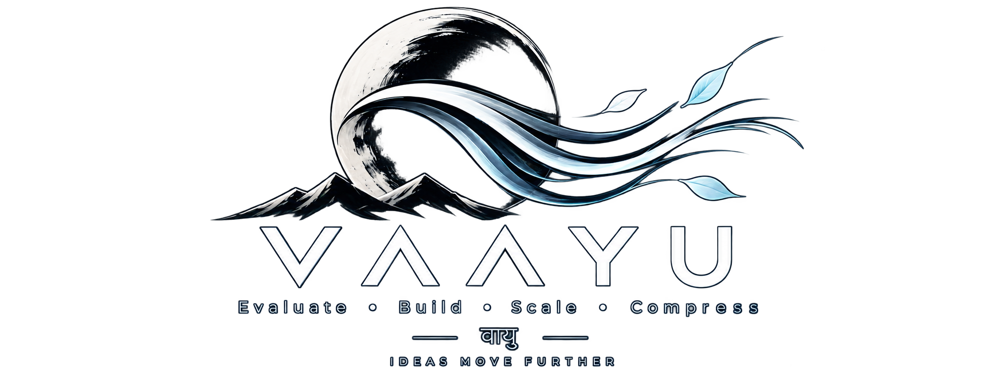

<p align="center">
  
</p>

<h1 align="center">Vaayu</h1>

<p align="center">
  <em>Production-grade skills for AI coding agents. Evaluate, build, scale, compress.</em>
</p>

<p align="center">
  
  
  
  
  
  
  
  
  
  
  
  
</p>

---

**Vaayu** is a collection of hand-crafted skills for the open
[Agent Skills](https://agentskills.io) standard. Every skill is a single portable
`SKILL.md` — no vendor lock-in, no mandatory hooks, no runtime — load it in any
compatible agent and it just works.

- **Portable** — one format across every major coding agent
- **Zero-config** — drop in a skill directory and triggers on intent
- **Low context cost** — progressive disclosure, compact frontmatter

## Skills

| Skill | Purpose | Pure analysis |
|---|---|---|
| [**karm**](./karm/) | Production-readiness evaluation — turns ideas into build-ready plans covering features, testing, security, performance, scalability, and cost. | |
| [**veg**](./veg/) | Problem & product evaluation — hackathon, startup, and requirement analysis into feasible, buildable solutions. | ✅ |
| [**vega-velocity**](./vega-velocity/) | Scalability engineering — end-to-end evaluation for 20k+ concurrent users, from architecture to cost. | ✅ |
| [**laghu**](./laghu/) | Token compression — drops filler, keeps substance and technical accuracy. | |

`veg` and `vega-velocity` need no code execution — safe for claude.ai.

## Install

### npm — any agent

```bash
npx skills add okyashgajjar/vaayu --skill karm
npx skills add okyashgajjar/vaayu --skill veg
npx skills add okyashgajjar/vaayu --skill vega-velocity
npx skills add okyashgajjar/vaayu --skill laghu
```

Target a specific agent with `-a codex`, `-a gemini`, `-a cursor`, etc.

### Claude Code

```bash
claude skill add karm/SKILL.md
claude skill add veg/SKILL.md
claude skill add vega-velocity/SKILL.md
claude skill add laghu/SKILL.md
```

### claude.ai

Upload the zips from [`claudeai/`](./claudeai/) at
**Customize → Skills → + Create skill → Upload a skill**.
Requires a Pro/Max/Team/Enterprise plan with code execution enabled.

| Skill | Archive |
|---|---|
| veg | [`claudeai/veg.zip`](./claudeai/veg.zip) |
| vega-velocity | [`claudeai/vega-velocity.zip`](./claudeai/vega-velocity.zip) |

### Manual — any agent

Copy each skill folder into your agent's skills directory:

```bash
cp -r karm ~/.claude/skills/
cp -r veg ~/.agents/skills/
# …or sync between agents
npx sync-skill claude codex
```

## Compatibility

Built strictly on the portable core of the spec — `name` + `description`
frontmatter, lowercase hyphenated folders — so no extensions to translate.

| Agent | Path |
|---|---|
| Claude Code | `.claude/skills/`, `~/.claude/skills/` |
| OpenAI Codex | `.agents/skills/`, `~/.codex/skills/` |
| Gemini CLI | `.gemini/skills/`, `.agents/skills/` |
| Cursor | `.cursor/skills/` |
| Windsurf | `.windsurf/skills/`, `.agents/skills/` |
| Cline · Roo · Kilo | `.agents/skills/`, `.clinerules/skills/` |
| OpenCode | `.opencode/skills/`, `.claude/skills/` |
| Copilot | `.copilot/skills/`, `.github/skills/` |
| Goose | `~/.config/goose/skills/`, `.agents/skills/` |
| Antigravity | `.agent/skills/` |
| claude.ai | zip upload |

## Triggering

Skills activate on intent. Each carries a tight `description` (≤200 chars) that
agents match against the task.

| Skill | Triggers on |
|---|---|
| `karm` | a product idea or architecture needing a readiness plan |
| `veg` | hackathon / startup problem statements or requirements |
| `vega-velocity` | scale, performance, or production architecture |
| `laghu` | "laghu mode", "be brief", "compress", "less tokens", `/laghu` |

## Contributing

Skills live as a single file each — edit `*/SKILL.md` and open a PR.

```bash
npm run validate   # all SKILL.md files present
```

Keep changes to the portable core: portable beats clever.

## License

[MIT](./LICENSE)